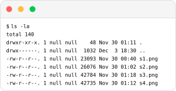

# what

[Typst](https://github.com/typst/typst) template for emulating terminal screenshots

# how

## input

```typst
#import "term.typ": term

#term(
  ps1: [`$`],
  input: [`ls -la`],
  output: [
  `total 140
drwxr-xr-x. 1 null null    48 Nov 30 01:11 .
drwx------. 1 null null  1032 Dec  3 18:30 ..
-rw-r--r--. 1 null null 23093 Nov 30 00:40 s1.png
-rw-r--r--. 1 null null 26076 Nov 30 01:02 s2.png
-rw-r--r--. 1 null null 42784 Nov 30 01:18 s3.png
-rw-r--r--. 1 null null 42735 Nov 30 01:12 s4.png`
  ],
)
```

## output



# why

- no need to take screenshots
- no need to store screenshots
- vector graphics instead of raster

# how (in-depth)

## download the template

```
curl https://raw.githubusercontent.com/qo/term/main/term.typ --output term.typ
```

## import it wherever you want it

```typst
#import "term.typ": term
```

## pass the needed parameters to the `term` function

### `ps1`

the primary prompt which is displayed before each command.

### `input`

the command that comes after `ps1`

### `output`

the output that the command produces
